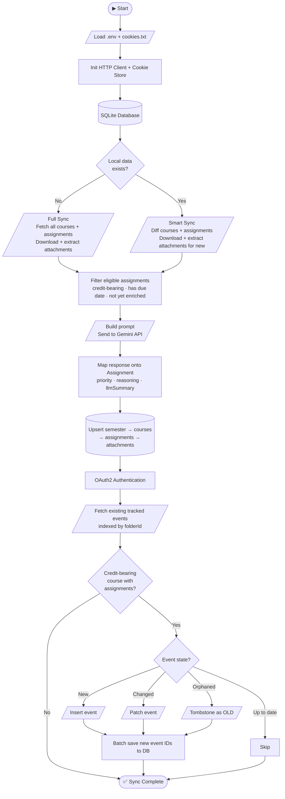

# Brightspace Assignment Tracker

Keeping track of assignment deadlines across multiple courses can quickly become overwhelming.

Brightspace Assignment Tracker automatically syncs your assignments from Brightspace, enriches each one with an AI generated summary and priority score, and pushes them directly to Google Calendar, so your deadlines are always organized without any manual entry.

## Architecture and Evolution

### The Shift from Scraping to REST

The project’s first iteration utilized Jsoup for HTML parsing. While functional, reliance on front end CSS selectors proved unstable. After researching Brightspace’s developer resources and analyzing browser network traffic, I transitioned to using REST API endpoints for a more reliable and maintainable integration.

### From Data Retrieval to Stateful Synchronization

As the project evolved, the focus expanded beyond simple data retrieval:

- API responses are mapped into internal domain models to decouple the application from external schema changes.
- A repository layer was introduced to hydrate previously synchronized data from local JSON storage, enabling incremental synchronization across runs.
- Synchronization logic was redesigned to be idempotent, using `orgUnitId` for course deduplication and `folderId` as a unique assignment key to prevent duplicate entries across repeated runs.
- Unit tests were later introduced using JUnit 5 and Mockito to validate synchronization behavior and edge cases.

### Transition to Relational Persistence

The recent evolution replaced local JSON storage with a SQLite backed repository, improving data integrity and enabling more robust synchronization.

- Atomic Saves: The sync pipeline now gathers all required data (API metadata and LLM enrichment) before performing a single final upsert, preventing partial writes and reducing the risk of database corruption.
- Time zone Awareness: Migration from `LocalDateTime` to `OffsetDateTime` ensures assignment deadlines remain accurate regardless of system time zone.
- Hallucination Safeguards: `daysUntilDue` is now computed in application code instead of by the LLM, preventing hallucinated values.

### Implementation of Google Calendar Sync

With assignment data cleaned, enriched, and persisted locally, the next step was extending the pipeline to sync enriched assignment data into Google Calendar.

- Self Healing Recovery: Each event is tagged with a private extended property containing its Brightspace `folderId`. This allows the system to reconcile existing events even when the local database is lost. This also allows us to easily generate new LLM enrichment, by deleting the database file, we can get new summaries and priorities while avoiding duplication of calendar events.
- Tombstoning: If a calendar event exists in Google Calendar but is no longer present in Brightspace, such as when a professor removes or closes an assignment, the event is marked as "[OLD]" rather than deleted outright, preserving the user's deadline history.
- Idempotent Updates: Before patching an event, the sync compares the remote state against expected values for summary, description, timestamps, and colorId. Updates only take place when a difference is detected, minimizing unnecessary API calls.
- Urgency Color Coding: Event color is derived from `daysUntilDue` at sync time rather than priority. Assignments are only sent to the LLM once, minimizing API token consumption. Using `daysUntilDue` ensures the event color is revaluated on each run.

### Interface Implementation for Demo Mode

All three external API dependencies: Brightspace, Gemini, and Google Calendar, were abstracted behind interfaces (`BrightspaceDataSource`, `LlmDataSource`, and `CalendarDataSource`).

These changes paved the way for demo mode. Concrete implementations can be swapped at the application's entry point without touching any business logic. `AssignmentService`, `LlmService`, and `GoogleCalendarService` have no awareness of whether they're handling live API data or local demo data.

## Mermaid Flow Chart


## Technical Implementation

### Project Structure

```text
src/main/java/com/alexdamolidis/
├── ai/         (LLM integration and AI enrichment services)
├── calendar/   (Calendar sync setup and logic)
├── client/     (Brightspace API communication)
├── exception/  (Custom exceptions for different categories of failures)
├── model/      (Semester, Course, Assignment, and Attachment POJOs)
├── parser/     (HTML sanitization and text normalization utilities)
├── repository/ (SQLite persistence and SQL schema management)
├── service/    (Synchronization logic and duplicate detection)
└── util/       (API validation, endpoint configuration, and content extraction helpers)

src/main/resources/
└── demo/       (Mock data for Demo Mode)

src/test
└── test/java/  (JUnit 5 and Mockito test suites)

.cookies.example.txt (Template for Brightspace session cookies)
.env.example.txt     (Template for required environment variables)

tracker.db      (Main relational database - git-ignored)
cookies.txt     (Local session storage    - git-ignored)
.env            (Stores Gemini API key, Google Calendar Id, and Semester name - git-ignored)
googleAuth.json (Google OAuth credentials - git-ignored)
```

### Data Mapping Strategy

The Brightspace API returns large, nested objects. To simplify processing, I leveraged URL query filters to limit responses to only relevant records before mapping them to domain models.

Credit Based Filtering: Uses the _VC marker in course codes to differentiate credit bearing courses from non academic resources. Since both may contain assignments, this ensures only relevant coursework is processed.

Integrity Logic: Uses folderId as a unique assignment key and orgUnitId as a unique course key to guarantee assignment uniqueness and maintain consistent state across repeated synchronization runs.

## Setup and Usage

### AI Summarization Notice
The assignment summarization feature sends assignment contents and attachment text to a Large Language Model for summarization, reasoning, and priority scoring.

Users should be aware that Google's free tier API may store and use submitted content for service improvement. Because course materials may be considered institutional intellectual property, sending this data through the free tier API could violate your school's policies.

To avoid this risk, it is strongly recommended to use a paid API tier or locally hosted LLM where submitted data is not retained or used for training.

### Authentication Setup
This project integrates three distinct services. Please follow the steps below to configure your local environment.

### 1. Brightspace Session Access
Because students cannot self register for official Brightspace OAuth without admin approval, this project uses session based cookie authentication.

    1. Log in to Brightspace in your browser.

    2. Open Developer Tools(F12) -> Network -> Doc.

    3. Refresh the page, select the home request, and copy the Cookie request header value.

    4. Create a cookies.txt file in the project root and paste the entire string into the first line.

### 2. Google Gemini AI Enrichment

    1. Obtain an API key from Google AI Studio.

    2. Create a .env file in the project root (see .env.example).

    3. Add your key: API_KEY= yourKeyHere.


### 3. Google Calendar API (OAuth 2.0) Setup
To sync your assignments, you need to create an application in the Google Cloud Console and link it to a specific calendar.

#### Project & API Enablement

    1. Open the Google Cloud Console and log in.

    2. Click New Project (top left). Name it, leave the "Location" as no organization, and click Create. Ensure this new project is selected in the top dropdown.

    3. In the top search bar, search for Google Calendar API and select it.

    4. Click Enable.

#### OAuth Consent Configuration
    5. In the left sidebar, navigate to APIs & Services → OAuth consent screen.

    6. Select External as the User Type and click Create.

    7. Fill in the required fields (App name, User support email, Developer contact email) and click Save and Continue.

    8. On the Test Users screen, click Add Users and add your own Google email address. (Crucial: If you skip this, the app will silently fail to authenticate). Click Save and Continue.

#### Generating Credentials
    9. In the left sidebar, navigate to APIs & Services → Credentials.

    10. Click + Create Credentials at the top and select OAuth 2.0 Client ID.

    11. Under "Application type", select Desktop App, name it, and click Create.

    12. Click Download JSON on the resulting dialog box.

    13. Rename the downloaded file to googleAuth.json and place it in the root directory of this project.

#### Linking Your Calendar
    14. Open Google Calendar in your browser.

    15. Find the calendar you want to sync to, click the three dots next to it ⋮ → Settings and sharing.

    16. Scroll down to the "Integrate calendar" section and copy the Calendar ID (it often looks like an email address).

    17. Add it to your .env file as: GOOGLE_CALENDAR_ID=yourCalendarIdHere

First Run Authorization:
On the very first execution, a browser window will open asking you to authorize the app. Because this is a local developer app, Google will show a "Google hasn’t verified this app" warning. Click Advanced → Go to [Your App Name] (unsafe) to proceed. A tokens/ directory will be created automatically to cache your credentials for future runs.

### Demo Mode 
If you want to test the application's core logic without setting up any Brightspace cookies, API keys, or Google Cloud Console, you can run demo mode. This mode replaces all external API calls with mock data (located in the `src/main/resources/demo` directory).

Please note on repeated runs: To simulate realistic upcoming/past deadlines, demo mode dynamically calculates assignment due dates based on your current system clock (eg. now + 3 days). Because the system time advances between runs, the engine will always detect a slight change in the due date and trigger a "Detected change in: assignment" update during the sync phase on all subsequent runs.

### Multi Institution Compatibility

While configured for the D2L "Slate" environment, this tool can be adapted for other Brightspace instances.
Modify the EndpointBuilder class to update the base URL or API version string to match your institution’s Brightspace domain.

Slate uses "_VC" in the Course Code to indicate whether or not a course is credit bearing. If your school uses a different 
indicator, you will have all courses set to: worth credits. This means running non credit bearing assignments through the llm
for enrichment and having them synced to your calendar. 

To adapt this filter, modify the `unpackOrgUnit` method in the `Course` model to match your institution's indicator.

### Execution Commands
    mvn compile          # compile the project 
    mvn test             # run the test suite 
    mvn exec:java        # run the application  
    mvn exec:java@demo   # run the application in demo mode (uses local mock data)

## Roadmap

 - [x] REST API integration and JSON to object mapping

 - [x] Mockito backed unit test suite for synchronization logic

 - [x] LLM based assignment summarization and priority scoring

 - [x] Persistent local storage (SQLite integration)

 - [x] Logger implementations

 - [x] Google Calendar API export

 - [x] Demo mode to run the application with pre loaded data
